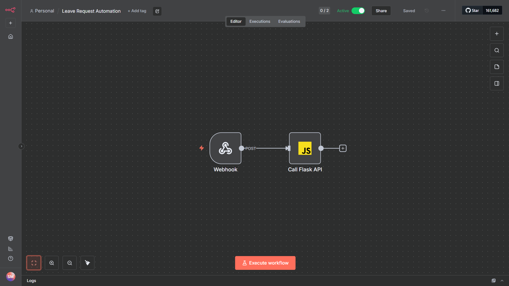
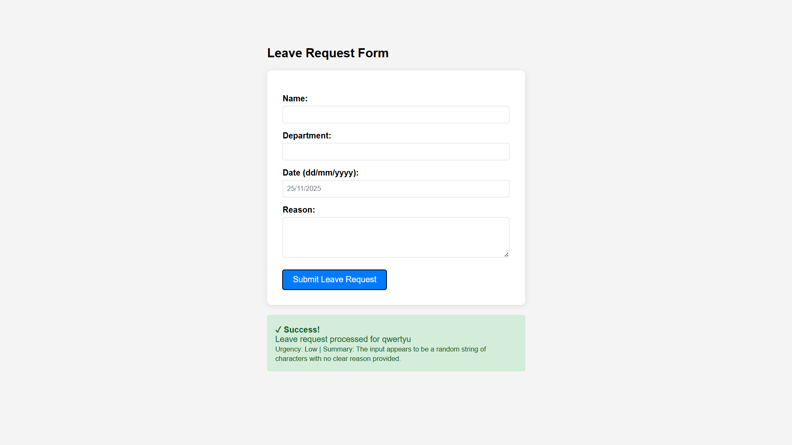

# 🤖 Leave Automation System

An intelligent system designed for leave requests that features full workflow automation, including AI-driven urgency classification and reason summarization, as well as automated logging and instant notifications.



## 🌟 Features

- **AI-Powered Classification and summarization**: Automatically categorizes leave requests by urgency and summarizes the reason using OpenAI GPT
- **Smart Workflow**: n8n-based automation for seamless data flow
- **Automated Logging**: Instant Google Sheets integration for record-keeping
- **Real-time Notifications**: Slack alerts to the manager
- **User-Friendly Interface**: Clean, responsive HTML form
- **Comprehensive Tracking**: Full audit trail of all requests

## 🏗️ Architecture

```
User Form → n8n Webhook → Flask API → OpenAI Classification → n8n Webhook → Response to User
                                    → Google Sheets Logging
                                    → Slack Notification
```

## 🛠️ Tech Stack

### Backend
- **Python 3.x** - Core programming language
- **Flask** - Web framework
- **OpenAI API** - AI-powered text analysis

### Automation
- **n8n** - Workflow automation (Docker)
- **Docker & Docker Compose** - Containerization

### Integrations
- **Google Sheets API** - Data storage and logging
- **Slack Webhooks** - Team notifications
- **OAuth2** - Google API authentication

### Frontend
- **HTML5/CSS3** - User interface
- **JavaScript** - Form handling and API communication

## 📋 Prerequisites

- Python 3.8 or higher
- Docker Desktop
- OpenAI API key
- Google Cloud Console account (for Sheets API)
- Slack workspace (optional, for notifications)

## 🚀 Installation

### 1. Clone the Repository

```bash
git clone https://github.com/YOUR-USERNAME/leave-automation-system.git
cd leave-automation-system
```

### 2. Set Up Python Environment

```bash
# Create virtual environment
python -m venv venv

# Activate virtual environment
# Windows:
venv\Scripts\activate
# Mac/Linux:
source venv/bin/activate

# Install dependencies
pip install -r requirements.txt
```

### 3. Configure Environment Variables

Create a `.env` file in the root directory:

```env
OPENAI_API_KEY=sk-your-openai-api-key
SLACK_WEBHOOK_URL=https://hooks.slack.com/services/YOUR/WEBHOOK/URL
SHEETS_CREDENTIALS_JSON_PATH=path/to/credentials.json
SHEETS_SPREADSHEET_ID=your-spreadsheet-id
PORT=5000
```

### 4. Set Up Google Sheets API

1. Go to [Google Cloud Console](https://console.cloud.google.com/)
2. Create a new project
3. Enable Google Sheets API
4. Create Service Account credentials
5. Download credentials JSON file
6. Share your Google Sheet with the service account email

### 5. Start n8n with Docker

```bash
cd n8n-docker
docker-compose up -d
```

n8n will be available at `http://localhost:5678`

### 6. Import n8n Workflow

1. Access n8n at `http://localhost:5678`
2. Login with credentials (admin/admin123)
3. Import the workflow from `leave-request-workflow.json`
4. Activate the workflow

### 7. Run Flask Application

```bash
python app.py
```

Flask will run at `http://localhost:5000`

### 8. Access the Application

Open `templates/form.html` in your browser via HTTP server:

```bash
python -m http.server 8000
```

Then navigate to `http://localhost:8000/templates/form.html`

## 📖 Usage

1. **Submit Leave Request**: Fill out the form with employee details
2. **Automatic Processing**: 
   - n8n receives the request
   - Flask processes the data
   - OpenAI analyzes urgency
   - Data logged to Google Sheets
   - Slack notification sent
3. **Receive Confirmation**: Instant feedback with classification results

## 📸 Screenshots

### Leave Request Form


### n8n Workflow


### Execution Results


## 🔧 Configuration

### n8n Workflow Settings

The workflow consists of 2 nodes:
1. **Webhook Node**: Receives form submissions
2. **Code Node**: Processes data and calls Flask API

### Flask Endpoints

- `POST /process-leave`: Main endpoint for leave request processing

### Environment Variables

| Variable | Description | Required |
|----------|-------------|----------|
| `OPENAI_API_KEY` | OpenAI API key for GPT access | Yes |
| `SLACK_WEBHOOK_URL` | Slack incoming webhook URL | Optional |
| `SHEETS_CREDENTIALS_JSON_PATH` | Path to Google service account JSON | Yes |
| `SHEETS_SPREADSHEET_ID` | Google Sheets spreadsheet ID | Yes |
| `PORT` | Flask application port | No (default: 5000) |

## 🐛 Troubleshooting

### n8n Can't Reach Flask

**Problem**: Docker container can't access Flask on localhost

**Solution**: Use `http://host.docker.internal:5000` instead of `http://localhost:5000`

### Google Sheets Permission Denied

**Problem**: Service account doesn't have access

**Solution**: Share the spreadsheet with service account email address

### OpenAI API Error

**Problem**: Invalid API key or quota exceeded

**Solution**: Check API key in `.env` and verify OpenAI account credits

## 🤝 Contributing

Contributions are welcome! Please feel free to submit a Pull Request.

1. Fork the repository
2. Create your feature branch (`git checkout -b feature/AmazingFeature`)
3. Commit your changes (`git commit -m 'Add some AmazingFeature'`)
4. Push to the branch (`git push origin feature/AmazingFeature`)
5. Open a Pull Request

## 📝 License

This project is open source and available under the [MIT License](LICENSE).

## 👤 Author

**Sheikh Mushfiqur Rakib**

- GitHub: [@sk-mushfiq](https://github.com/sk-mushfiq)
- Email: smushfiqurrakib@gmail.com
- LinkedIn: [Sheikh Mushfiqur Rakib](https://linkedin.com/in/skmushfiq)

## 🙏 Acknowledgments

- OpenAI for providing the GPT API
- n8n community for workflow automation tools
- Flask framework for simple and elegant web development

## 📚 Project Structure

```
leave-automation-system/
├── app.py                              # Main Flask application
├── llm_utils.py                        # OpenAI integration utilities
├── sheets_utils.py                     # Google Sheets integration
├── requirements.txt                    # Python dependencies
├── .env.example                        # Environment variables template
├── .gitignore                          # Git ignore rules
├── README.md                           # Project documentation
├── templates/
    └── form.html                       # Leave request form
├── n8n-docker/
    ├── docker-compose.yml              # n8n Docker configuration
    └── leave-request-workflow.json     # Importable n8n workflow
└── screenshots/                        # Project screenshots
    ├── workflow.png
    ├── form.png
    └── execution.png
```

## 🔮 Future Enhancements

- [ ] Add user authentication
- [ ] Implement approval workflow
- [ ] Email notifications
- [ ] Mobile app integration
- [ ] Advanced analytics dashboard
- [ ] Multi-language support

---

⭐ If you found this project helpful, please consider giving it a star!
